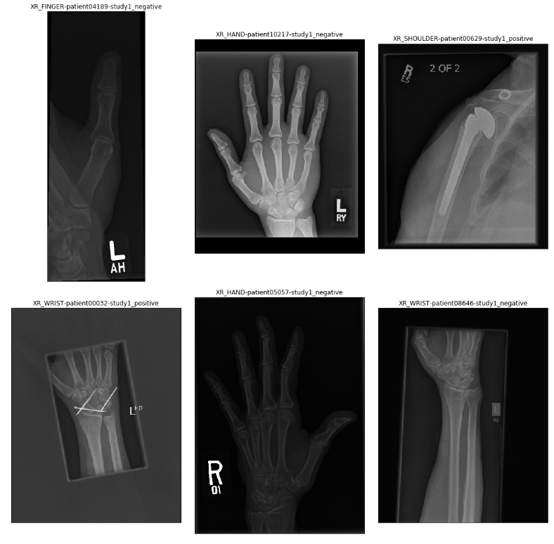
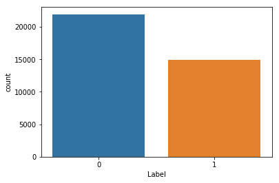
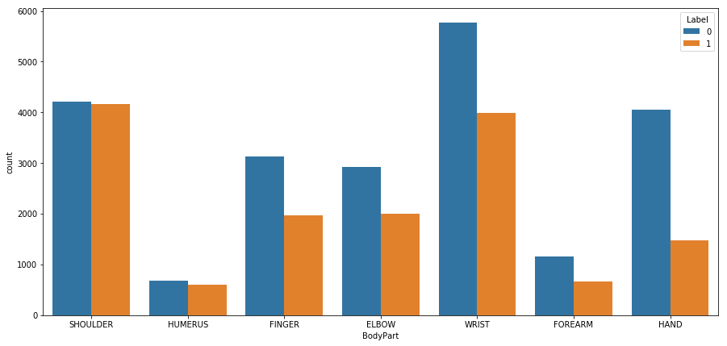

# MURA Stanford

A PyTorch implementation of 169 layer DenseNet model on MURA dataset, inspired from the [paper](https://arxiv.org/abs/1712.06957) Pranav Rajpurkar et al.

# Overview


Musculoskeletal conditions affect more than 1.7 billion people worldwide, and are the most common cause of severe, long-term pain and disability, with 30 million emergency department visits annually and increasing. MURA (musculoskeletal radiographs) is a large dataset of bone X-rays. Algorithms are tasked with determining whether an X-ray study is normal or abnormal. MURA is a large dataset of musculoskeletal radiographs, where each study is manually labeled by radiologists as either normal or abnormal.


## Contents
  - [1. Setup Instructions and Dependencies](#1-Setup-Instructions-and-Dependencies)
  - [2. Dataset](#2-Dataset)
  - [3. Training the model](#3-Training-the-model)
  - [4. Architecture](#4-Architecture)
  - [5. Repository overview](#5-Repository-overview)


## 1. Setup Instructions and Dependencies

Clone the repositiory on your local machine.

``` Batchfile
git clone https://github.com/ishanrai05/MURA-stanford
```

Start a virtual environment using python3
``` Batchfile
virtualenv env
```


Install the dependencies
``` Batchfile
pip install -r requirements.txt
```

You can also use google collab notebook. In that case just upload the notebook provided in the repository and you are good to go.

## 2. Dataset

The dataset is available to download from the official site [here](https://stanfordmlgroup.github.io/competitions/mura/). Download and extract the dataset in same directory. 

Alternatively you can run:

``` Batchfile
source download.sh
```



### Folder Structure
```
- MURA-v1.1
  - train/
    -  Elbow/
       - Patient{id}
         - Image1
         - Image2
         - Image3
    -  Shoulder
    - ..
  - test/
    -  Elbow/
       - Patient{id}
         - Image1
         - Image2
         - Image3
    -  Shoulder
    - ..
  - csv files
```

### Dataset overview





## 3. Training the model

To train the model, run

```Batchfile
python main.py --train=True
```

optional arguments:
  | argument | default | desciption|
  | --- | --- | --- |
  | -h, --help | | show help message and exit |
  | --use_cuda | False | device to train on. default is CPU |
  | --samples | False | See sample images |
  | --view_data_counts | False | Visualize data distribution |
  | --num_epochs | 10 | Number of epochs to train on |
  | --train | True | train the model |

## 4. Architecture

 - The implemented model is a 169 layer DenseNet with single node output layer initialized with weights from a model pretrained on ImageNet dataset.
 - Before feeding the images to the network, each image is normalized to have same mean and standard deviation as of the images in the ImageNet training set, scaled to 224 x 224 and augmentented with random lateral inversions and rotations.
 - The model uses modified Binary Cross Entropy Loss function as mentioned in the paper.
 - The Learning Rate decays by a factor of 10 every time the validation loss plateaus after an epoch.
 - The optimization algorithm is Adam with default parameters β1 = 0.9 and β2 = 0.999.


## 5. Repository overview


This repository contains the following files and folders

1. **notebook**: This folder contains the jupyter notebook for code.

2. **resources**: Contains images.

3. `CustomLoss.py`: Custom Loss as given in paper.

4. `CustomModel.py`: Customized Densenet169 model as given in paper.

5. `read_data.py`: code to read images.

6. `visualize.py`: code for visualizations.

7. `MuraDatasets.py`: Pytorch code to read dataset.

8. `train.py`: function to train models from scratch.

9. `main.py`: contains main code to run the model.

10. `requirements.txt`: Lists dependencies for easy setup in virtual environments.

11. `download.sh`: shell script to download the dataset.